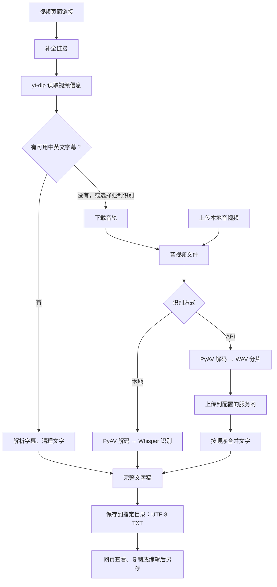

# 技术栈与数据流

V2T 把视频链接或本地音视频转成中英文 TXT。网页负责操作，Python 负责获取字幕、运行模型和保存文件；识别可在本机完成，也可交给用户配置的 API。

## 一次转写怎样完成

**字幕优先**可以省下模型计算或 API 费用。这里只读取网站提供的字幕文件，不识别画面中的文字；没有可用字幕时，通过音频识别。TXT 只保留文字，不保留时间轴。

没有协议的链接补上 `https://`；裸 `bilibili.com`、`youtube.com` 还会补上 `www.`，其他子域名与短链接保持原样。

## 用了哪些技术

| 技术 | 做什么 | 为什么用它 |
| --- | --- | --- |
| Python 3.12 | 串联下载、转写、文件保存 | 音视频与模型工具丰富，网页和命令行可以共用处理代码。 |
| Flask | 提供本机网页与任务接口 | 体积小，适合这个只在本机运行的服务。 |
| HTML / CSS / JavaScript | 页面、样式、按钮和任务状态 | 不需要额外前端框架或 npm 构建，便于修改。 |
| yt-dlp | 解析视频网站、获取字幕或音轨 | 复用已有网站适配，网站变化时可更新此依赖。 |
| pysubs2 | 读取 SRT / WebVTT 字幕 | 不必自行实现字幕格式解析。 |
| PyAV | 解码音视频、转换声道和采样率 | 在 Python 中使用 FFmpeg 底层能力，处理常见媒体格式。 |
| Whisper | 根据声音生成文字 | 提供多个模型大小，支持中文与英文。 |
| faster-whisper / CTranslate2 | 加载模型并在 CPU / NVIDIA GPU 上计算 | 支持量化推理，降低本地运行的资源需求。 |
| requests | 向兼容的转写 API 上传音频 | 便于控制超时、错误提示与重试。 |
| psutil | 查询当前可用内存 | 给模型选择提供本机资源参考。 |
| Python 多进程 | 在独立进程中处理耗时任务 | 网页保持响应；停止任务时可以结束计算并释放资源。 |
| uv / `.venv` / `uv.lock` | 安装并隔离依赖、固定版本 | 不依赖用户原有 Python 环境，方便换电脑安装。 |

可以把 **Whisper** 理解为训练好的模型，**faster-whisper** 是使用它的 Python 工具，**CTranslate2** 是执行模型计算的引擎。三者承担不同职责，不是三个需要分别选择的模型。

## 本地模型和 API 的区别

| | 本地模式 | API 模式 |
| --- | --- | --- |
| 识别在哪里执行 | 自己的电脑 | 配置的服务商服务器 |
| 首次准备 | 下载所选模型；GPU 按需安装运行库 | 填写服务地址、Model ID 和自己的密钥 |
| 主要开销 | 模型磁盘、内存或显存、电力 | 上传流量与服务商费用 |
| 音频是否上传到识别服务 | 不上传 | 需要识别时上传 |
| 没有独立显卡 | 可用 CPU，速度取决于模型与电脑 | 本机只需完成解码和请求 |

本地识别先把音频转为波形，再用 VAD（语音活动检测）跳过部分无语音片段，Whisper 逐段生成文字。GPU 模式仍需要 CPU 解码和系统内存；长音频可能明显增加内存占用。

API 模式将音频分为 WAV 片段，按顺序请求并合并结果。当前支持兼容 OpenAI 音频转写协议的接口；服务商的 Model ID 不一定与本地模型名称相同。本地配置检查不会实际调用 API，也不能验证余额或权限。部分网络和服务端错误最多尝试 3 次，重试可能产生重复计费。

## 模型选择与 GPU 判断

模型档位、下载大小和常见显卡参考见 [模型怎么选](README.md#模型怎么选)。模型权重由使用者按需下载，源码中不附带权重；限制中文和英文也不会裁剪多语言模型文件。

- `auto`：优先使用可用的 NVIDIA GPU；条件不足时说明原因并使用 CPU。
- `cpu`：使用 INT8 计算，适合没有 NVIDIA 显卡的电脑。
- `cuda`：使用 NVIDIA GPU 和 INT8_FLOAT16；条件不满足时提示错误，不自动改用 CPU。

INT8 和 FP16 是计算时使用的数值精度，帮助减少资源占用，不会自动缩小磁盘上的模型文件。当前没有 Apple GPU 或 AMD GPU 推理路径。

切换模型时，程序检查**当前可用**内存、显存、磁盘及 GPU 运行条件，给出是否适合运行的估算。显卡型号和标称显存只能作为参考，其他程序也会占用资源。

“下载所选模型并自检”会实际加载模型并执行一次短输入推理。评估与自检都不是长视频必然成功的保证，也不代表识别准确率。可选 GPU 库保存在项目 `.runtime/` 中，不要求改动系统 CUDA。

## 队列和停止如何工作

网页把任务交给 Flask，`task_manager.py` 在服务端内存中维护顺序，每次只启动一个工作进程。浏览器定期查询状态，不负责运行模型。

- 入队时固定该项的模型、语言、设备、保存目录和 API 配置，并保管上传副本。
- 等待项可上移、下移、移除；执行期间仍能添加新项。
- 单项失败后继续下一项；停止会终止当前任务并暂停队列，保留等待项。
- 点击继续后处理剩余等待项，已取消的项需要重新添加。
- 刷新或关闭网页不会清空队列；重启本地服务会清空队列和最近结果记录，已保存 TXT 保留。

完整结果返回后，父进程才写入 TXT；已接受取消的任务不会保存半成品。停止 API 任务只能结束本地连接，远端是否继续计算或收费取决于服务商。

## 文件和隐私

TXT 自动保存到用户指定目录，同名文件会编号，避免覆盖；保存失败最多尝试 3 次，不重新转写。网页编辑后需要点击另存，刷新会丢失未保存的编辑。

模型与 GPU 库留在本机供后续使用。上传副本、下载媒体和 API 分片属于临时数据，任务结束或移除等待项后清理。原始本地文件不会被删除。

个人配置保存在 `settings.local.json`，其中保存的 API Key 是**明文**；也可通过 `V2T_API_KEY` 或 `OPENAI_API_KEY` 环境变量提供。密钥不会通过查询接口返回网页。不要把个人配置、Cookie、模型、缓存、音视频或 TXT 上传到 GitHub；仓库的 `.gitignore` 和源码打包工具会排除默认的个人数据路径。

## 从哪里读代码

| 文件 | 主要职责 |
| --- | --- |
| `app.py` | 网页入口、输入校验与任务接口 |
| `templates/index.html`、`static/` | 页面和交互 |
| `task_manager.py`、`worker.py` | 队列、工作进程、停止与结果提交 |
| `transcribe.py` | 获取字幕、下载音轨、本地转写与命令行入口 |
| `api_transcribe.py` | 音频分片、兼容 API 请求与文字合并 |
| `model_manager.py`、`device_manager.py` | 模型下载与自检、资源评估、CPU / GPU 选择 |
| `gpu_runtime.py` | 可选 NVIDIA 运行库安装 |
| `settings.py`、`storage.py` | 本地设置、密钥读取与 TXT 保存 |
| `start.py`、`install.*` | 启动服务、打开网页、准备环境 |

建议沿“`app.py` 提交任务 → `task_manager.py` 调度 → `worker.py` 处理 → `storage.py` 保存”阅读。安装与故障处理见 [INSTALL.md](INSTALL.md)。
